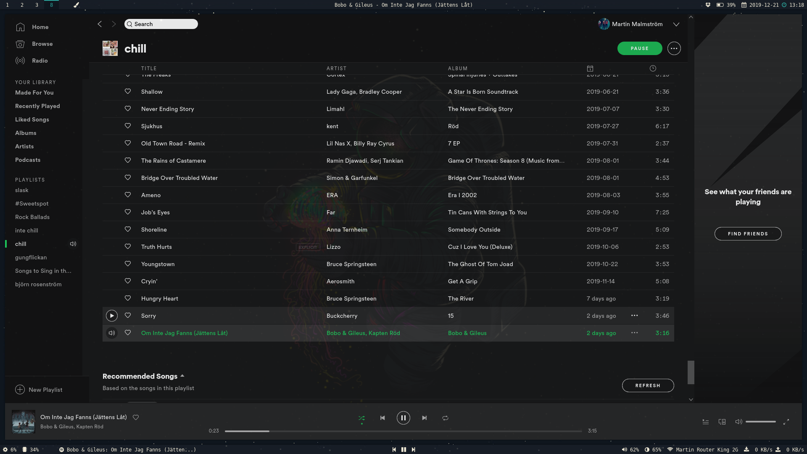

# marmals dotfiles

This is my dotfiles for two setups. I switch between an i3-gaps setup with polybar as panel and vifm as file manager etc.
and sometimes i use my KDE plasma setup.  
I recommend to install "yay" (yet another yoghurt) which is an AUR helper and makes installing packages from the arch user repository alot easier. `https://github.com/Jguer/yay`

# Plasma
### Details

---

- **OS**: Arch
- **DE**: Plasma
- **WM**: KWin
- **Dock**: Latte 
- **Terminal Emulator**: urxvt
- **File Manager**: Dolphin
- **Launcher**: KRunner
- **Editors**: vim, VSCode
- **Browser**: firefox
- **Music Player**: Spotify
- **Setup Font**: DejaVu Sans Mono, FontAwesome

### Dependencies 

---

|Dependency | Description | Why? |
|-----------|-------------|-----|
| `plasma` | Desktop Environment | Because it's nice |
| `sddm` | Simple Desktop Display Manager | Preferred display manager for Plasma |
| `dolphin` | File manager | To preview files |
| `latte-dock` | Dock | It's a nice taskbar |
| `kvantum-qt5` | Theme engine | For elegance |
| `ttf-dejavu`| DejaVu Sans Mono | Font for all of my configurations|
| `FontAwesome`| Font awesome | Icons|
| `rxvt-unicode`| Urxvt | Terminal emulator |
| `zsh` | zsh shell | I just like it more than bash |
| `vim` | Vim text editor | I use this to configure files |
| `code` | VSCode | I use VSCode on projects |
| `xdg-utils` | xdg | To get commans like xdg-open etc |
| `firefox` | firefox | My default web-browser |
| `openssh` | SSH-keys | To generate keys | 
| `git` | Git | Yes. |
| `curl` | curl | To make http requests |

### Configurations

---

- Global Theme
  - `Aritim-dark` 
- Icons
  - `la capitaine`
- Cursor
  - `OSX El Capitan`
- Application Style
  - `Configure GNOME/GTK Application Style` -> `McHigh sierra dark-alt`
- Window Decorations
  - Modify as you like, i use mac-like
- `~/.config/gtk-3.0/settings.ini`
  - Add `gtk-decoration-layout=close,minimize,maximize:menu`
- Desktop Effects
  - `Blur`
    - Change `Blur strength` to medium and `Noise strength` to light
    - If blur does not exist: go to `Compositor` -> change rendering backend to `OpenGL 3.1`
  - `Magic lamp`
    - 400ms
  - `Wobbly windows`
- Kwin Scripts
  - `Force Blur`
- Splash Screen
  - `None`
- Login screen
  - Chili for plasma
  - Change background
  - modify /usr/share/sddm/themes/plasma-chili/Login.qml
  - "implicitHeight: usernameFontSize * 2"
  - comment out "opacity: passwordFieldOutlined ? 0.75 : 0.5"
  - add "horizontalAlignment: TextInput.Center" under line: "revealPasswordButtonShown: hidePasswordRevealIcon"
  - add "textColor: "#ffffff"" under: "onAccepted: startLogin()"
  - comment out: "textColor: passwordFieldOutlined ? "white" : "black"" and "placeholderTextColor: passwordFieldOutlined ? "white" : "black""
  - change radius to 7 in function plasmaComponents.textfield
  - comment out: "border.color: "white"" and "border.width: 1" and "color: passwordFieldOutlined ? "transparent" : "white""
  - add: "color: "#f1f1f1"" and "opacity: 0.25"
- Lock screen
  - Change lock screen background
- Panel
  - Add new empty panel
  - Right-Click -> New widgets -> Get new widgets -> Download new plasma widgets
    - Chili clock
    - Simple menu
    - Latte separator
    - Application title
    - Pager -> Configure -> Add to 5 desktops and Show application icons
  - Add widgets
    - Notifications
    - Search
    - Chili clock
    - Audio volume
    - Networks
    - System tray
    - Simple menu
    - Application title
    - Global menu
  - Configure application title
    - Bold
    - Text type: application name
  - Configure chili clock
    - Use 24-hour clock
    - Use fixed font size: 14
    - Date format: long date
  - Configure system tray
    - Uncheck: audio, notifications and networks
  - Change height to 28
  - Add spacers to your fitting
  - Settings -> Input Devices -> Keyboard -> Add a language -> Change layout indicator to flag, shortcut to shift+caps lock
- Open kvantum manager
  - Change/delete theme -> select `KvMojave`
  - Configure active theme
    - Hacks -> `Transparent menu title`
    - Compositing and general look -> `Window opacity 5%` and `Menu opacity 15%`
- Dock
  - Appearance
    - Items
      - Absolute: 50px
      - Zoom to hover: 80%
    - Margins
      - Height: 15%
    - Background
      - Size: 100%
      - Opacity: 35%
      - Uncheck: shadows
  - Effects
    - Indicators
      - Length: 10%
    - Latte indicator options
      - Dot
      - Check `Different color for minimized windows`
  - Tasks
    - Interaction
      - Uncheck `Add launchers only in task area`

# i3
### Details

---

- **OS**: Arch
- **WM**: i3
- **Panel**: polybar
- **Terminal Emulator**: urxvt
- **Compositor**: picom
- **File Manager**: vifm
- **Launcher**: rofi
- **Editors**: vim, VSCode
- **Browser**: firefox
- **Music Player**: Spotify
- **Lock Screen**: LightDM
- **Setup Font**: DejaVu Sans Mono, FontAwesome

## Screenshots

--- 

### Dependencies 

---

|Dependency | Description | Why? |
|-----------|-------------|-----|
| `ttf-dejavu`| DejaVu Sans Mono | Font for all of my configurations|
| `FontAwesome`| Font awesome | Icons|
| `rxvt-unicode`| Urxvt | Terminal emulator |
| `zsh` | zsh shell | I just like it more than bash |
| `vim` | Vim text editor | I use this to configure files |
| `code` | VSCode | I use VSCode on projects |
| `i3-gaps` | i3 WM with gaps | Because i like it |
| `yay -S polybar` | polybar panel | I need a panel |
| `rofi` | Run launcher | To start applications |
| `picom` | Compositor | To fade windows |
| `vifm` | File manager | To preview files |
| `lightdm` | Login Manager | To get a login manager |
| `networkmanager` | Network Manager | To connect with wifi |
| `wget` | wget | To retrieve files using http, https etc |
| `intel-microcode` | Microcode for my computer | A kernel module |
| `linux-firmware` | Linux firmware | Firmware files for linux |
| `base-devel` | Base devel | Some GNU tools, needed for AUR repos |
| `mesa` | Mesa drivers | Drivers for GPU etc |
| `xorg & xorg-xinit & xorg-xclock` | X | Display server to run WM's etc |
| `xdg-utils` | xdg | To get commans like xdg-open etc |
| `xfce4-power-manager` | Power Manager | To manage power settings |
| `light-locker` | Light locker | To be able to lock/unlock lightdm session |
| `ufw` run `ufw enable` | - | A firewall |
| `pulseaudio` | Sound system | To be able to play like spotify |
| `firefox` | firefox | My default web-browser |
| `openssh` | SSH-keys | To generate keys | 
| `git` | Git | Yes. |
| `curl` | curl | To make http requests |
| `nitrogen` run `nitrogen path/to/wallpaper.jpg` | Nitrogen | To set wallpaper |

### Configurations

---

- i3
  - `~/.i3/config`
- polybar
  - `~/.config/polybar`
- polybar modules
  - Spotify
    - https://github.com/dietervanhoof/polybar-spotify-controls So i can change/paus/play/view songs i play in panel.
  - Dropbox
    - https://github.com/polybar/polybar-scripts/tree/master/polybar-scripts/isrunning-dropbox To check if dropbox is running.
  - Usb
    - https://github.com/polybar/polybar-scripts/tree/master/polybar-scripts/system-usb-udev To view mounted devices and to unmount them. paste *95-usb.rules* file to `/etc/udev/rules.d/95-usb.rules`.
  - Bluetooth
    - Not currently but i will add it.
  - Calendar
    - https://github.com/polybar/polybar-scripts/tree/master/polybar-scripts/popup-calendar If i click on date i get a calendar pop-up.
  - If you want to use the script *network-networkmanager* script to view your network don't forget to add the *90-polybar* file to `/etc/NetworkManager/dispatcher.d/90-polybar`. 
- rofi
  - `~/.config/rofi`
- picom
  - `~/.config/picom.conf`
- vifm
  - `~/.config/vifm`
- lightdm
  - Theme i use: https://github.com/Litarvan/lightdm-webkit-theme-litarvan
  - Edit `/etc/lightdm/lightdm.conf` and set `greeter-session=lightdm-webkit2-greeter`
  - Edit `/etc/lightdm/lightdm-webkit.conf` and set `webkit-theme` to `litarvan`
- lid
  - Edit `/etc/systemd/logind.conf`
  - Uncomment `HandleLidSwitch=suspend`, `HandleLidSwitchExternalPower=suspend` and `HandleLidSwitchDocked=suspend`

# Same for both setups

### Gestures for touchpad

---

- *https://github.com/bulletmark/libinput-gestures*
- run: `yay -S libinput-gestures-git`
- cp config file `/etc/libinput-gestures.conf` to `~/.config/libinput-gestures.conf`
- run `sudo gpasswd -a $USER input`. You need to be a member of the *input* group to have permission to read the touchpad device, -> reboot.
- Remove scroll to switch desktops: Right-clock desktop -> Configure desktop -> Mouse actions -> remove
- Autostart gestures with KDE: `libinput-gestures-setup autostart`

### Additional Dependencies

---

|Dependency | Description | Why? |
|-----------|-------------|-----|
| `urxvt-perls`| Extensions for urxvt | To be able to copy/paste from the terminal etc |
| `zsh-completions` | zsh extension | Completions |
| `zsh-syntax-highlighting` | zsh extension | Highlight text |
| `sh -c "$(curl -fsSL https://raw.githubusercontent.com/ohmyzsh/ohmyzsh/master/tools/install.sh)"` | zsh framework | To style zsh |
| `git clone https://github.com/VundleVim/Vundle.vim.git` | Vim bundler | To manage plugins in vim |
| `yay -S dropbox` | Dropbox | To store my keepass database |
| `keepass` | KeePass | To open my keepass database |
| `https://linuxhint.com/install-spotify-arch-linux/` | Spotify | To listen to music |
| `network-manager-applet` | Applet for Network Manager | To connect with a GUI (not needed for plasma setup) |
| `xdg-user-dirs` run `xdg-user-dirs-update` | - | Creates some default folders, like Photos, Videos etc. |  
| `galculator` | galculator | A calculator i like to use |  
| `flameshot` | Screenshot tool | Nice to have |
| `feh` | View images | from cli `feh ` |
| `zathura` && `zathura-djvu` && `zathura-pdf-mupdf` | Minimalistic document viewer | Nice to have |

### Useful Commands

- `xwininfo`
  - I use this to get information about the window, for when i make scripts etc.

# Global configurations 

### Change from lightdm to sddm
- `sudo systemctl disable lightdm` lightweight login menu
- `sudo systemctl enable sddm` prefered kde login menu

### Configurations

- urxvt
  - `~/.Xresources`
  - `xrdb -merge ~/.Xresources` to apply changes
- zsh
  - `~/.zshrc`
  - Add theme to `~/.oh-my-zsh/themes`
- vim
  - `~/.vimrc`
- VSCode
  - Theme i use: *Material Theme Palenight* 
  - Extensions i like: *vscode-icons*, *bracket-pair colorizer 2*, *Vim*
  - I also add my fonts to VSCode: `file->preferences->settings` and add *'Font Awesome 5 Brands','Font Awesome 5 Free','DejaVu Sans Mono','FontAwesome'* to font family.
- pacman 
  - `/etc/pacman.conf`
  - I add:
  - *color*
  - *TotalDownload*
  - *CheckSpace*
  - *VerbosePkgLists*
  - *ILoveCandy*
- Touchpad gestures
  - `~/.config/libinput-gestures.conf`
- Firefox
  - `https://github.com/eduardhojbota/moonlight-userChrome` 

### Shortcuts

I use same shortcuts in both i3 and plasma. To configure shortcuts in i3 see `~/.i3/config`. To configure in plasma look below.  

##### Global shortcuts
- KRunner
  - run: shift+mod+enter
- KWin
  - close window: shift+mod+c
  - hide window border: shift+mod+b
  - window fullscreen: shift+mod+f
  - maximize window: mod+f
  - minimize window: mod+m
  - quick tile left: shift+mod+h
  - quick tile bottom: shift+mod+j
  - quick tile top: shift+mod+k
  - quick tile right: shift+mod+l
  - show desktop grid: mod+g
  - switch one desktop left: ctrl+shift+left arrow
  - switch one desktop right: ctrl+shift+right arrow
  - switch to desktop 1-8: mod+1-8
  - move window to desktop 1-8: shift+mod+1-8
  - switch to window above: mod+k
  - switch to window below: mod+j
  - switch to window left: mod+h
  - switch to window right: mod+l
- latte dock
  - remove all shortcuts
  - except, show latte dock: mod+f1
  

##### Custom shortcuts
- edit->new->global shortcut->url/command
  - trigger: mod+enter
  - action: urxvt
- edit->new->global shortcut->send keyboard input
  - Trigger: mod+q
  - action: Ctrl+PgUp
- edit->new->global shortcut->send keyboard input
  - trigger: mod+e
  - action: Ctrl+PgDown

### fast grub boot
- https://askubuntu.com/questions/67874/speed-up-booting-time-without-losing-choosing-capability-in-grub
- update grub in arch: sudo grub-mkconfig -o /boot/grub/grub.cfg

//remove
Saker som ska gittas:
X ~/.Xresources
X ~/.zshrc
X ~/.vimrc
X ~/.i3
~/.config/polybar
all shit i data folder
  kolla vad som har pushats. pusha resten
X ~/.config/rofi
X ~/.config/picom.conf
X ~/.config/vifm
X ~/.config/libinput-gestures.conf
X ~/.aliases
X ~/.config/gtk-2.0
X ~/.config/gtk-3.0
X ~/.config/zathura

X .config/lattedockc
X .config/kglobalshortcutsrc
X .config/krunnerrc  
X .config/kwinrc

